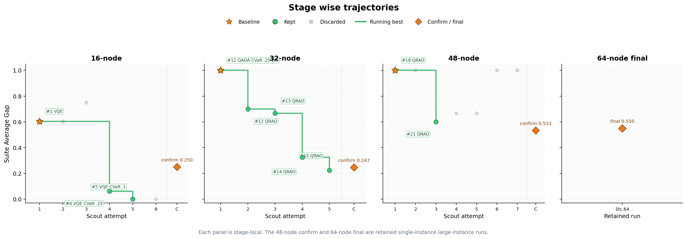

# AutoQResearch



AutoQResearch is an LLM-guided closed-loop experimentation framework for
adaptive variational quantum optimization. It searches over solver-control
policies rather than one static solver configuration: each policy can react to
diagnostics from earlier attempts, including feasibility, optimality gap,
stagnation, sampling concentration, and instance scale.

## Publication Status

This repository accompanies the accepted QCE26 paper:

> **AutoQResearch: LLM-Guided Closed-Loop Policy Search for Adaptive
> Variational Quantum Optimization**  
> Monit Sharma and Hoong Chuin Lau  
> QCE26 Technical Paper 238, Quantum-GenAI Co-Design & Discovery (QGDD)
> Technical Papers

The accepted work evaluates AutoQResearch on Maximum Independent Set (MIS) and
a decomposed Capacitated Vehicle Routing Problem (CVRP) workflow. The public
artifact in this repository focuses on the auditable policy-search framework,
MIS curriculum, solver implementations, promotion logs, plots, hardware-run
specifications, and analysis outputs used to support the reported results.

## What This Repo Contains

```text
autoqresearch/        Core Python package: problems, solvers, backends, metrics
experiment.py         Editable policy surface searched by the LLM agent
evaluate_policy.py    Fixed suite evaluator and paper artifact generator
agent_harness.py      Scout/keep/revert/promotion harness
agent_journal.md      Human-readable search journal
program.md            Unmodified agent instructions used for the MIS search
individual/mis/       DIMACS-style MIS benchmark instances
policy_checkpoints/   Promoted policy snapshots
experiment_diffs/     Archived policy diffs
plots/                Generated paper and progress plots
paper_analysis/       Tables for resource, scaling, and Pareto analyses
hardware_runs/        IBM Runtime runner, static retained policies, hardware logs
studies/              Prompt-ablation study manifests and prompts
legacy/               Legacy example notebooks retained for reference
docs/                 Project map and paper/reproducibility notes
```

Generated Python bytecode is intentionally not tracked. Runtime logs and
checkpoints are kept when they are part of the paper artifact.

See [docs/REPOSITORY_LAYOUT.md](docs/REPOSITORY_LAYOUT.md) for a more detailed
map of stable entry points and generated artifact locations.

## Core Idea

AutoQResearch casts variational quantum solver design as sequential policy
search over a curated action space. The LLM is restricted to a small policy
surface in `experiment.py`, while evaluation, metric semantics, suite splits,
promotion rules, and artifact generation remain fixed.

The editable policy surface consists of four functions:

1. `choose_solver_family(problem)`
2. `build_base_policy(problem, family)`
3. `should_continue(attempt, history, problem, max_attempts)`
4. `adapt_policy(attempt, history, problem, base_policy)`

Those functions define a controller of the form:

```text
state_t -> action_t
```

Actions can change solver family, ansatz, optimizer, CVaR mode, depth/reps,
shots, compression strategy, rounding strategy, and stopping behavior.

## Solver Space

The framework includes solver families used during the MIS policy search:

- VQE: variational eigensolver over QUBO formulations
- QAOA: standard, warm-start, and multi-angle variants
- PCE: Pauli Correlation Encoding through a weighted MaxCut reduction
- QRAO: qubit-compressed Quantum Random Access Optimization with rounding

The package also includes problem generators and utilities for MaxCut, MIS,
MDKP, and knapsack-style QUBO experiments.

## Evaluation Methodology

The paper artifact emphasizes staged confirmation rather than one-shot proxy
optimization:

- **Scout:** cheap proxy evaluation under a fixed workflow
- **Promote:** rerun top beam candidates on the full stage suite
- **Confirm:** select the confirmed winner while replaying earlier-stage
  guardrails
- **Final:** evaluate the locked policy on the held-out stage

The primary metric is `suite_average_gap`:

- `0.0` means optimal on every instance in the evaluated split
- `1.0` means total failure, timeout, crash, or infeasible/trivial output
- Lower is better

Resource usage, wall time, feasibility, and concentration are recorded for
analysis, but the main keep/revert decision is driven by the fixed metric and
guardrail rules.

## Quick Start

Create an environment and install dependencies:

```bash
python -m venv .venv
./.venv/bin/pip install -r requirements.txt
```

On Windows PowerShell, activate the same environment with:

```powershell
python -m venv .venv
.\.venv\Scripts\pip install -r requirements.txt
```

Validate the Python stack:

```bash
./.venv/bin/python prepare.py --validate-only
```

Run a single MIS probe:

```bash
./.venv/bin/python evaluate_policy.py --suite mis_probe_16 --workflow split --split train --no-artifacts
```

Run the first MIS scout workflow:

```bash
./.venv/bin/python agent_harness.py --suite mis_curriculum_16 --eval-workflow scout --wall-clock-budget 1800 --beam-width 5 --no-dev
```

Promote the current beam:

```bash
./.venv/bin/python agent_harness.py --suite mis_curriculum_16 --promote-beam --promote-top-k 3 --restore-best
```

Run the retained 64-node held-out final suite after locking the policy:

```bash
./.venv/bin/python evaluate_policy.py --suite mis_curriculum_64 --workflow final --no-artifacts
```

## Reproducing Paper Artifacts

The repository already contains the search logs, promotion records, policy
snapshots, and generated tables/plots used by the paper artifact. The main
files are:

- `agent_journal.md`: narrative record of the MIS search
- `experiment_log.jsonl`: candidate-level keep/discard trace
- `beam_history.jsonl` and `beam_state.json`: scout beam history and state
- `promotion_log.jsonl`: full-suite promotion confirmations
- `suite_results.tsv` and `instance_results.jsonl`: suite and instance ledgers
- `paper_analysis/`: paper-facing tables
- `plots/`: paper-facing figures and progress visualizations

See [docs/PAPER.md](docs/PAPER.md) for the paper-specific artifact guide and
citation note.

## Hardware Runs

Hardware execution support lives under `hardware_runs/`. The default retained
MIS policy runner can be inspected without touching IBM Runtime:

```bash
./.venv/bin/python hardware_runs/run_autoq_hardware.py --instance 1tc.32 --plan-only
```

Credential templates are included, but real credential files are ignored by
Git.

## Notes for Future Work

The current public artifact intentionally preserves logs and checkpoints so the
QCE26 result remains auditable. If you reorganize runtime paths, update
`agent_harness.py`, `evaluate_policy.py`, `program.md`, and the docs together;
several artifact names are part of the reproducibility contract.

